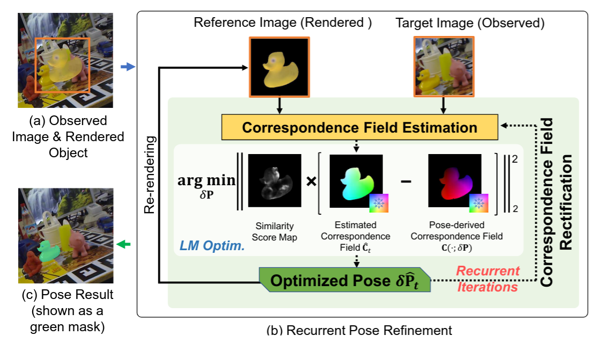
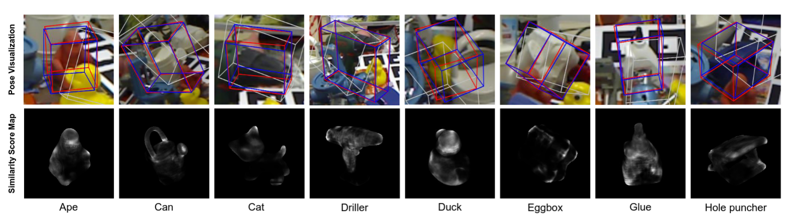

# RNNPose: Recurrent 6-DoF Object Pose Refinement with Robust Correspondence Field Estimation and Pose Optimization

Yan Xu, Junyi Lin, Guofeng Zhang, Xiaogang Wang, Hongsheng Li. 

*Conference on Computer Vision and Pattern Recognition (CVPR), 2022.*

[[Paper]](https://scholar.google.com/scholar?hl=zh-CN&as_sdt=0%2C5&q=RNNPose%3A+Recurrent+6-DoF+Object+Pose+Refinement+with+Robust+Correspondence+Field+Estimation+and+Pose+Optimization&btnG=) 
[[Official Repo]](https://github.com/DecaYale/RNNPose) 


## 1. Framework 
The basic pipeline of our proposed RNNPose.  (a) Before refinement, a reference image is rendered according to the object initial pose (shown in a fused view).
(b) Our RNN-based framework recurrently refines the object pose based on the estimated correspondence field between the reference and target images. The pose is optimized to be consistent with the reliable correspondence estimations highlighted by the similarity score map (built from learned 3D-2D descriptors) via differentiable LM optimization.  (c) The output refined pose.  

<!--  -->
<p align="center">

</p>

## 2. Pose Estimation with Occlusions and Erroneous Pose Initializations


### Estimated Poses and Intermediate System Outputs from Different Recurrent Iterations. 

<p align="center">
 
</p>


### Pose Estimates with Erroneous Pose Initializations
Visualization of our pose estimations (first row) on Occlusion LINEMOD dataset and the similarity score maps (second row) for downweighting unreliable correspondences during pose optimization. 
For pose visualization, the white boxes represent the erroneous initial poses, the red boxes are estimated by our algorithm and the ground-truth boxes are in blue. Here, the initial poses for pose refinement are originally from PVNet but added with significant disturbances for robustness testing. 
<center class="half">
   
</center>


## 3. More Details
Please refer to our [official repository](https://github.com/DecaYale/RNNPose). 

## 4. Citation
If you find our code useful, please cite our paper. 
```
@inproceedings{xu2022rnnpose,
  title={RNNPose: Recurrent 6-DoF Object Pose Refinement with Robust Correspondence Field Estimation and Pose Optimization},
  author={Xu, Yan and Kwan-Yee Lin and Zhang, Guofeng and Wang, Xiaogang and  Li, Hongsheng},
  booktitle={Proceedings of the IEEE/CVF Conference on Computer Vision and Pattern Recognition},
  year={2022}
}
```


<!-- ## 7. Acknowledgement

The skeleton of this code is borrowed from [RSLO](https://github.com/DecaYale/RSLO). We also would like to thank the public codebases [PVNet](https://github.com/zju3dv/pvnet), [RAFT](https://github.com/princeton-vl/RAFT), [SuperGlue](https://github.com/magicleap/SuperGluePretrainedNetwork) and [DeepV2D](https://github.com/princeton-vl/DeepV2D).  -->

<!-- ## TODO List and ETA
- [x] Inference code and pretrained models (25/12/2021)
- [ ] Training code
- [ ] Code cleaning and improvement -->


